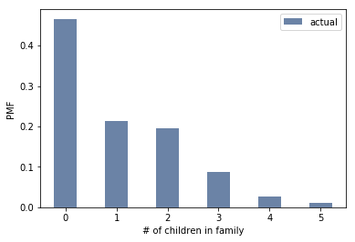
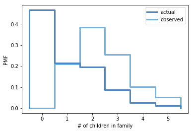

[Think Stats Chapter 3 Exercise 1](http://greenteapress.com/thinkstats2/html/thinkstats2004.html#toc31) (actual vs. biased)

# Problem  
Exercise 3.1 Something like the class size paradox appears if you survey children and ask how many children are in their family. Families with many children are more likely to appear in your sample, and families with no chil- dren have no chance to be in the sample.
Use the NSFG respondent variable NUMKDHH to construct the actual distribution for the number of children under 18 in the household.
Now compute the biased distribution we would see if we surveyed the children and asked them how many children under 18 (including themselves) are in their household.
Plot the actual and biased distributions, and compute their means. As a starting place, you can use chap03ex.ipynb.

# Answer  

Format: ![Plot 1]

Format: ![Plot 2]

# Python code  
```python
resp = nsfg.ReadFemResp()

resp_pmf = thinkstats2.Pmf(resp.numkdhh, label='actual')
width = 0.45
thinkplot.Hist(resp_pmf, align='center', width=width)
print('actual mean', resp_pmf.Mean())

def BiasPmf(pmf, label):
    new_pmf = pmf.Copy(label=label)
    for x, p in pmf.Items():
        new_pmf.Mult(x, x)
    new_pmf.Normalize()
    return new_pmf

biased_pmf = BiasPmf(resp_pmf, label='observed')
print('observed mean', biased_pmf.Mean())
thinkplot.PrePlot(2)
thinkplot.Pmfs([resp_pmf, biased_pmf])
thinkplot.Show(xlabel='# of children in family', ylabel='PMF')
```