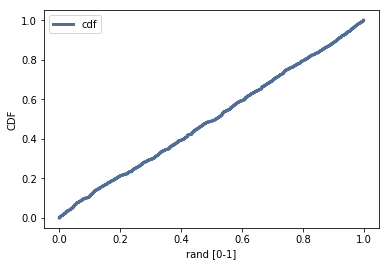

[Think Stats Chapter 4 Exercise 2](http://greenteapress.com/thinkstats2/html/thinkstats2005.html#toc41) (a random distribution)

# Problem  
**Exercise 4.2** The numbers generated by random.random are supposed to be uniform between 0 and 1; that is, every value in the range should have the same probability.
Generate 1000 numbers from random.random and plot their PMF and CDF. Is the distribution uniform?

# Answer  
The distribution is almost perfectly uniform between [0,1] using the random.random. 

The CDF shows a perfectly uniform distribution:  
  

... and the PMF hence shows no higher probability for any number in the sample:
  

# Python code  
```python
import numpy as np
import thinkstats2
import thinkplot
sample = np.random.random(size=1000) # same as (b - a) * random_sample() + a, aka (1 - 0) * random_sample() + 0
sample

cdf_rand = thinkstats2.Cdf(sample, label='cdf')
thinkplot.Cdf(cdf_rand)
thinkplot.Show(xlabel='rand [0-1]', ylabel='CDF')

pmf_rand = thinkstats2.Pmf(sample, label='pmf')
thinkplot.hist(pmf_rand)
thinkplot.Show(xlabel='rand [0-1]', ylabel='pmf')
```